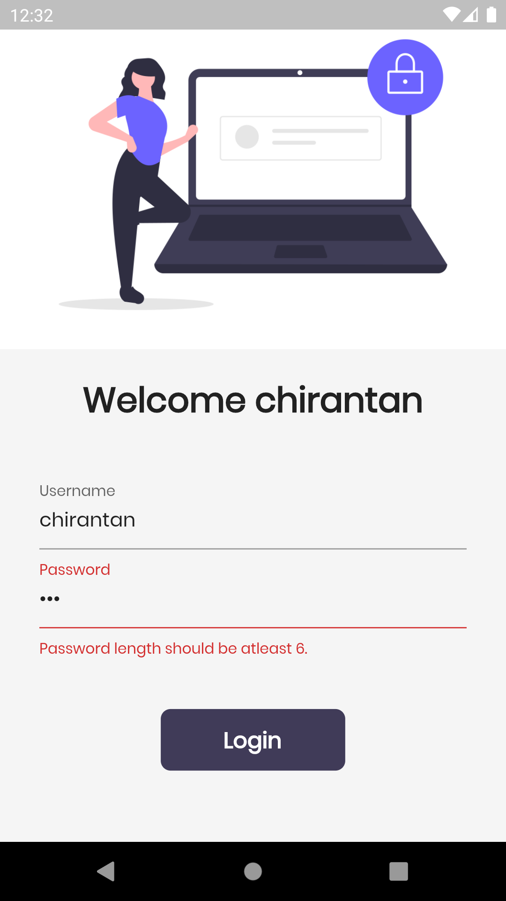

# Flutter Catalog App

> A Catalog app with basic  implementation using dart.

- Used material dart
- Used velocity-x for state management

## Demo Screenshots of the app

Login Page             |  Home Page
:-------------------------:|:-------------------------:
|  

Cart Page             |  Dark Theme Cart Page
:-------------------------:|:-------------------------:
|  